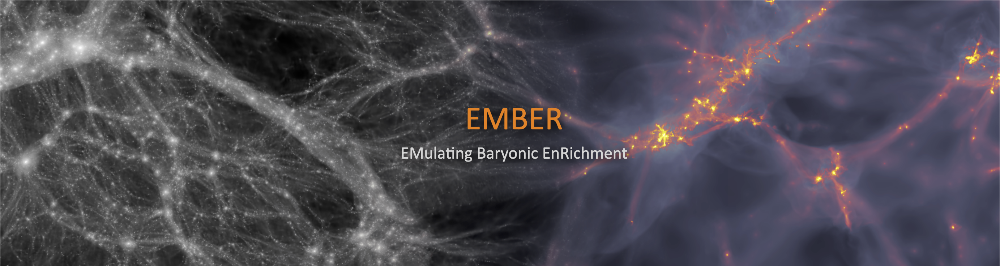

<!-- PROJECT SHIELDS -->
<!--
*** I'm using markdown "reference style" links for readability.
*** Reference links are enclosed in brackets [ ] instead of parentheses ( ).
*** See the bottom of this document for the declaration of the reference variables
*** for contributors-url, forks-url, etc. This is an optional, concise syntax you may use.
*** https://www.markdownguide.org/basic-syntax/#reference-style-links
-->
[![MIT License][license-shield]][license-url]
[![arXiv][arXiv-shield]][arXiv-url]


<br />
<p align="center">
  <a href="https://github.com/othneildrew/Best-README-Template">
    
  </a>
</p>


## About The Project
This repository provides the network implementation and training routines for the paper (...).
The code is written using the Tensorflow2 API, is easy to use and supports parallel training on multiple GPUs.
Simulations are part of the [FIRE project](https://fire.northwestern.edu).


### Networks
Pretrained networks and prediction maps can be found at [Google Drive](https://drive.google.com/drive/folders/10_7Y3xjwHeZFdX6Fm5luhl-lMkVKH63k?usp=sharing).


### Prerequisites and Usage
Note that the you may need to modify the code for your specific project.

1. Clone the repo
   ```sh
   git clone https://github.com/maurbe/ember.git
   ```
3. Install dependencies
   ```sh
   pip install numpy, matplotlib, tensorflow-gpu
   ```
4. Set the datapaths in `module.py`
5. Train the network
   ```sh
   python train.py
   ```

## License

Distributed under the MIT License. See `LICENSE` for more information.


<!-- MARKDOWN LINKS & IMAGES -->
<!-- https://www.markdownguide.org/basic-syntax/#reference-style-links -->
[license-shield]: https://img.shields.io/github/license/maurbe/ember?color=607D8B&style=for-the-badge
[license-url]: https://github.com/maurbe/ember/blob/master/LICENSE.txt
[arXiv-shield]: https://img.shields.io/badge/-arXiv-black.svg?style=for-the-badge&logo=arXiv&colorB=555
[arXiv-url]: https://google.com/
[product-screenshot]: images/screenshot.png
